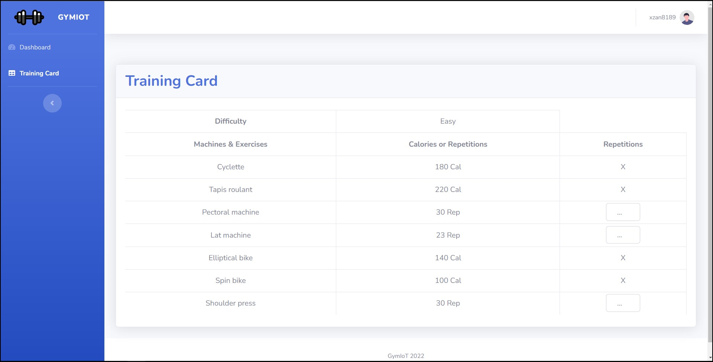
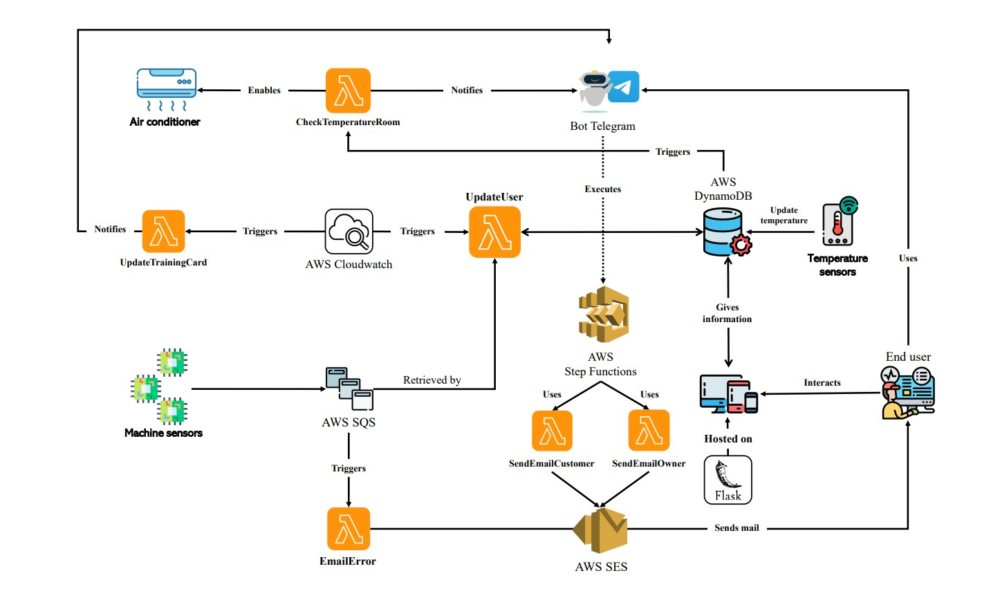

# IOT Gym using Serverless Computing

## Overview

GymIoT is a smart gym that keep track about your training, providing different functionalities in order to improve your workout.

It allows to achieve informations such as **calories consumed** and **time spent** on each machine.
Storing these kind of informations, over the weeks/months, we are able to generate a chart describing the progress of the trainings over the year. There is also the possibility to compare the progress of the current year with the previous one, in order to have an exhaustive understanding of your improvement.

In trainings it's not just important to figure out how many *calories* you should consume because in order to reach a good result you need to also understand what kind of **machine** you should use and what kind of **exercise** you should do and in what **sequence** you have to execute them!

So, based on these claims, it is introduced a **Training Card**. \
It looks like this:
<div align="center">

</div>

It shows for each *machine* the calories that you have to consume yet and for each *exercise* the repetitions that you need to do yet.\
When the customer doesn't follow correctly the training card, it will be send a message through the bot Telegram notifying him the machines and the exercises that he left undone, with their respective calories and reps remaining.

Today's **temperatures** are very high (for many reasons) and for this reason it could be a good solution to have an air conditioner in each gym room.
In this way we can adjust the temperature in the room in order to train with the best possibilities.\
When the temperature in a *gym room* is over a certain grade than it will be activated the air conditioner and it will be send a message on the bot Telegram to all the customers that are training in that room.\
The sending of message is important because some customers may have some problems with the air conditioning activated and for this reason they could talk with a responsible to disable it.

Another important service, offered always with a serverless approach, is the ability to **pay** the monthly bill through the Telegram bot.
Every time the customer pays the bill it will be send an email to him with the paid invoice, to keep track of his paid bills.\
There is also the possibility that the customer pays a specific tip, when this scenario happens it will be send an email also to the manager of the infrastructure saying who paid the tip.\
It is always a pleasure to know that the service provided is appreciated, which it means that the gym is working in the correct way and it is also in the same time a pleasure to know who helps us to grow.

Also, when there are problems related to the Iot devices placed in the machines, an email is sent to the manager to notify him about this.


## Implementation overview
There are two kind of IoT sensors:
* **Iot sensors placed in each machine:** they measure the `calories consumed` and the `time spent` by the customer on the machine.
  * Every time that the machine is used it will send a message with these values on the related queue.
  * The *updateUser* function is triggered every minute by AWS EventBridge and it checks each queue, related to machines, to see if there are any messages to process.
  * Once the *updateUser* function processes a message it checks if the informations contained in the message are correct, for this reason we have 2 ways:
    1. ***correct informations***: the function updates the calories consumed and the time spent by the customer and sends a message to the queue related to *Training_card*.
       * The *updateTrainingCard* function is triggered when a message arrives in the *Training_card* queue. This function updates the training card of the related customer and sends a message on the bot Telegram if the customer is not following correctly its training card.
    2. ***incorrect informations***: the function sends a message to the errors queue
       * The *emailError* function is triggered when a message arrives in the *Errors* queue. This function sends an email to the manager of the gym notifying him about the errors detected by the device.
* **Iot sensors placed in each gym room:** they measure the `temperature` in the room.
  * Every time that it measures the temperature in the room it modifies the item into the DB related to that gym room.
  * The *checkTemperatureRoom* function is triggered when there is an update in the database (enabling DynamoDB Streams on the specified table), in particular when an Item of the *Gym_rooms* table is modified.
  * The function takes the old and the new version of the Item modified and enables the air condition if the temperature is too high. 
  * Then it sends a message through the bot Telegram to the customers that are training in that room.

## Architecture

<div align="center">

</div>

* **Cloud environment:** simulated using [LocalStack](https://localstack.cloud/) to replicate the [AWS services](https://aws.amazon.com/)
* **IoT devices:** simulated with a Python function using [boto3](https://boto3.amazonaws.com/v1/documentation/api/latest/guide/quickstart.html) to send messages on the queues.
* **AWS Step Functions:** is a serverless orchestration service that lets you combine AWS Lambda functions and other AWS services to build business-critical applications. ([AWS Step Functions](https://docs.aws.amazon.com/step-functions/latest/dg/welcome.html))
* **AWS SQS:** The queues are implemented using [Amazon Simple Queue Service (SQS)](https://aws.amazon.com/sqs/)
* **AWS Lambda:** The functions are Serveless functions deployed on [AWS Lambda](https://aws.amazon.com/lambda/).
* **AWS DynamoDB:** [Amazon DynamoDB](https://aws.amazon.com/dynamodb/) is the service used to built the database.
  * Enabled [DynamoDB Streams](https://docs.aws.amazon.com/amazondynamodb/latest/developerguide/Streams.html) to capture modifications in a DynamoDB table.
* **AWS CloudWatch:** Implements the rule, through EventBridge, which invokes the serverless functions ([Amazon EventBridge](https://aws.amazon.com/eventbridge/))
* **AWS SES:** Used to send emails. ([AWS SES](https://aws.amazon.com/it/ses/))
* **Flask:** Web server which allows the use of Python as backend programming language. ([Flask](https://flask.palletsprojects.com/en/2.1.x/))
* **Telegram Bot API**: Thanks to this HTTP-based interface it was possible to create a bot for Telegram. ([Telegram API](https://core.telegram.org/bots/api#update))

## Installation and usage

### Prerequisites
1. [Docker](https://docs.docker.com/get-docker/)
2. [AWS CLI](https://docs.aws.amazon.com/cli/latest/userguide/getting-started-install.html)
3. [boto3](https://boto3.amazonaws.com/v1/documentation/api/latest/guide/quickstart.html)
4. [Flask](https://flask.palletsprojects.com/en/2.1.x/)
5. [Telegram Bot](https://t.me/BotFather)
6. (Optional) nodejs for database visualization.

### Setting up the environment

**0. Clone the repository**

```bash
git clone https://github.com/xzan8189/Gym-IoT.git
```

**1. Launch [LocalStack](https://localstack.cloud/)**

```bash
docker run --rm -it -p 4566:4566 -p 4571:4571 localstack/localstack
```

**2. Create an SQS queue for each machine**

```bash
aws sqs create-queue --queue-name Cyclette --endpoint-url=http://localhost:4566
aws sqs create-queue --queue-name Tapis_roulant --endpoint-url=http://localhost:4566
aws sqs create-queue --queue-name Elliptical_bike --endpoint-url=http://localhost:4566
aws sqs create-queue --queue-name Spin_bike --endpoint-url=http://localhost:4566
aws sqs create-queue --queue-name Training_card --endpoint-url=http://localhost:4566
aws sqs create-queue --queue-name Errors --endpoint-url=http://localhost:4566
```

* Check that they are been correctly created

```bash
aws sqs list-queues --endpoint-url=http://localhost:4566
```

**3. Create the DynamoDB tables and populate them**

1. Use the python code to create the DynamoDB tables and after check if they are correctly created
```bash
python3 settings/createTable.py
aws dynamodb list-tables --endpoint-url=http://localhost:4566
```

3. Populate the tables with some data, but before set `PYTHONPATH` environment variable in root project directory
```bash
export PYTHONPATH=.
```

and finally:

```bash
python3 settings/loadData.py
python3 settings/loadData2.py
python3 settings/loadData3.py
```

4. Check that the table are been correctly populated using the (dynamodb-admin) GUI with the command
```bash
DYNAMO_ENDPOINT=http://0.0.0.0:4566 dynamodb-admin
```

and then going to http://localhost:8001

5. Verify your email identity in order to receive emails
```bash
aws ses verify-email-identity --email-address sender@example.com --endpoint-url=http://localhost:4566
```

in this example i used "sender@example.com" as email.\
Now you need to edit the value `EMAIL_OWNER`, into the *config.py* file, with the email used (in this example "sender@example.com")

**4. Create the time-triggered Lambda function to elaborate the data**

1. Create the role
```bash
aws iam create-role --role-name lambdarole --assume-role-policy-document file://settings/role_policy.json --query 'Role.Arn' --endpoint-url=http://localhost:4566
```

2. Attach the policy 
```bash
aws iam put-role-policy --role-name lambdarole --policy-name lambdapolicy --policy-document file://settings/policy.json --endpoint-url=http://localhost:4566
```

3. Create zip files
```bash
zip updateUserFunc.zip settings/updateUserFunc.py
zip updateTrainingCardFunc.zip settings/updateTrainingCardFunc.py settings/config.py
```

4. Create the function and save the Arn (it should be something like <code>arn:aws:lambda:us-east-2:000000000000:function:updateUserFunc</code>


```bash
aws lambda create-function --function-name updateUserFunc --zip-file fileb://updateUserFunc.zip --handler settings/updateUserFunc.lambda_handler --runtime python3.8 --role arn:aws:iam::000000000000:role/lambdarole --endpoint-url=http://localhost:4566

aws lambda create-function --function-name updateTrainingCardFunc --zip-file fileb://updateTrainingCardFunc.zip --handler settings/updateTrainingCardFunc.lambda_handler --runtime python3.8 --role arn:aws:iam::000000000000:role/lambdarole --endpoint-url=http://localhost:4566
```

> if you want to delete the lambda functions, digit this:
```bash
aws lambda delete-function --function-name updateUserFunc --endpoint-url=http://localhost:4566
aws lambda delete-function --function-name updateTrainingCardFunc --endpoint-url=http://localhost:4566
```

5. Test the functions manually invoke *updateUserFunc* (it may take some times):
	```bash
	aws lambda invoke --function-name updateUserFunc out --endpoint-url=http://localhost:4566
	```
check within the table of dynamodb-admin that the item with *username="xzan8189"* is changed

6. From here you could jump directly to the [Use it](#use-it) step.

**5. Set up a CloudWatch rule to trigger the Lambda functions every 1 minute**

1. Creare the rule and save the Arn (it should be something like `arn:aws:events:us-east-2:000000000000:rule/<name_function>`)
```bash
aws events put-rule --name every_minute --schedule-expression 'rate(1 minutes)' --endpoint-url=http://localhost:4566
```

2. Check that the rule has been correctly created with the frequency wanted
```bash
aws events list-rules --endpoint-url=http://localhost:4566
```

3. Add permissions to the rule created
```bash
aws lambda add-permission --function-name updateUserFunc --statement-id every_minute --action 'lambda:InvokeFunction' --principal events.amazonaws.com --source-arn arn:aws:events:us-east-2:000000000000:rule/updateUserFunc --endpoint-url=http://localhost:4566

aws lambda add-permission --function-name updateTrainingCardFunc --statement-id every_minute --action 'lambda:InvokeFunction' --principal events.amazonaws.com --source-arn arn:aws:events:us-east-2:000000000000:rule/updateTrainingCardFunc --endpoint-url=http://localhost:4566
```

4. Add the lambda function to the rule using the JSON file containing the Lambda function Arn
```bash
aws events put-targets --rule every_minute --targets file://settings/targets.json --endpoint-url=http://localhost:4566
```

Now every minute the functions *updateUserFunc* and *updateTrainingCardFunc* will be triggered.

**6. Set up the Lambda function triggered by SQS messages that notifies errors in IoT devices via email**
1) Zip the Python file and create the Lambda function
```bash
zip emailError.zip settings/emailError.py settings/config.py
aws lambda create-function --function-name emailError --zip-file fileb://emailError.zip --handler settings/emailError.lambda_handler --runtime python3.8 --role arn:aws:iam::000000000000:role/lambdarole --endpoint-url=http://localhost:4566
```

> if you want delete the lambda function, digit this:
```sh
aws lambda delete-function --function-name emailError --endpoint-url=http://localhost:4566
```

2) Create the event source mapping between the funcion and the queue
```sh
aws lambda create-event-source-mapping --function-name emailError --batch-size 5 --maximum-batching-window-in-seconds 60 --event-source-arn arn:aws:sqs:us-east-2:000000000000:Errors --endpoint-url=http://localhost:4566
```

3) Test the mapping sending a message on the error queue and check that an email is sent
```sh
aws sqs send-message --queue-url http://localhost:4566/000000000000/Errors --message-body '{"device_id": "Cyclette","value_time_spent": "ERROR","value_calories_spent": "ERROR"}' --endpoint-url=http://localhost:4566
```

**7. Set up the Lambda function triggered every time there is a modification to "*Gym_rooms*" table into DynamoDB**
1) Create the zip file
```bash
zip checkTemperatureRoomFunc.zip settings/checkTemperatureRoomFunc.py settings/config.py
```

2) Create the function
```bash
aws lambda create-function --function-name checkTemperatureRoomFunc --zip-file fileb://checkTemperatureRoomFunc.zip --handler settings/checkTemperatureRoomFunc.lambda_handler --runtime python3.8 --role arn:aws:iam::000000000000:role/lambdarole --endpoint-url=http://localhost:4566
```
> If you want to delete the lambda function, digit this:
```bash
aws lambda delete-function --function-name checkTemperatureRoomFunc --endpoint-url=http://localhost:4566
```

3) In order to create the Event Source Mapping, between the function and the table, we need to retrieve the **StreamArn** of the table.\
Run this command and save the value that is within *StreamArn*
```bash
aws dynamodbstreams list-streams --endpoint-url=http://localhost:4566
```

5) Create the Event Source Mapping between the function and the table
```bash
aws lambda create-event-source-mapping --function-name checkTemperatureRoomFunc --batch-size 100 --starting-position LATEST --event-source arn:aws:dynamodb:us-east-2:000000000000:table/Gym_rooms/stream/2022-07-07T16:12:03.050 --endpoint-url=http://localhost:4566
```

6) Check if it is correctly created the Event Source Mapping
```bash
aws lambda list-event-source-mappings --endpoint-url=http://localhost:4566
```

**8. Create Step functions to invoke workflows of AWS Lambda**
1) Create zip files
```bash
zip sendEmailCustomerFunc.zip settings/step_functions/sendEmailCustomerFunc.py settings/config.py
zip sendEmailOwnerFunc.zip settings/step_functions/sendEmailOwnerFunc.py settings/config.py
```

2) Create the lambda functions
```bash
aws lambda create-function --function-name sendEmailCustomerFunc --zip-file fileb://sendEmailCustomerFunc.zip --handler settings/step_functions/sendEmailCustomerFunc.lambda_handler --runtime python3.8 --role arn:aws:iam::000000000000:role/lambdarole --endpoint-url=http://localhost:4566
aws lambda create-function --function-name sendEmailOwnerFunc --zip-file fileb://sendEmailOwnerFunc.zip --handler settings/step_functions/sendEmailOwnerFunc.lambda_handler --runtime python3.8 --role arn:aws:iam::000000000000:role/lambdarole --endpoint-url=http://localhost:4566
```

>if you want to delete the functions:
```bash
aws lambda delete-function --function-name sendEmailCustomerFunc --endpoint-url=http://localhost:4566
aws lambda delete-function --function-name sendEmailOwnerFunc --endpoint-url=http://localhost:4566
```

3) Create Step Functions and grant permissions to trigger Lambda functions.\
   1. Create the role
   ```bash
    aws iam create-role --role-name step_functions_role --assume-role-policy-document file://settings/step_functions/role_policy_step_functions.json --query 'Role.Arn' --endpoint-url=http://localhost:4566
    ```
   2. Attach the policy
   ```bash
    aws iam put-role-policy --role-name step_functions_role --policy-name lambdapolicy --policy-document file://settings/step_functions/policy.json --endpoint-url=http://localhost:4566
    ```
   3. Create state machine and save the "*stateMachineArn*"
   ```bash
    aws stepfunctions create-state-machine --name "ProcessTransactionStateMachine" --definition file://settings/step_functions/asl_definition.json --role-arn "arn:aws:iam::000000000000:role/step_functions_role" --endpoint-url=http://localhost:4566
    ```
   4. Modify the variable `STATE_MACHINE_ARN` within the `config.py` with the "*stateMachineArn*" saved previously.


**9. Setting Telegram bot**
1. Create a new bot requiring it from [BotFather](https://t.me/BotFather) through Telegram
2. Take the *token* and modify the variable `BOT_TOKEN` within the `config.py`.
3. Set a payment provider on the bot (i suggest Stripe) to enable payments.
4. Once you are done take the *token*, of the payment provider, and modify the variable `BOT_TOKEN_PAYMENT_PROVIDER` within the `config.py`
5. Run the Telegram bot
```bash
python3 telegram_bot_main.py
```

### Use it
1. Simulate the IoT devices
```bash
python3 machine_sensor.py
python3 temperature_sensor.py
```

2. Modify the variable `SECRET_KEY` within the `config.py` with a random string.

3. Run flask with the command:
```bash
export FLASK_APP=./main.py; flask run
```

4. Go to the website and see the new informations

## Future developments

* **Weight charts**: In this way we can track the change of our weight
* **Workout videos**: Even if the client is away for work, he can still train with our instructors. 