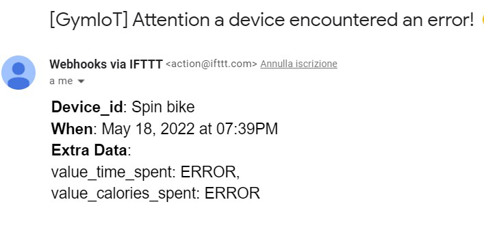

# IOT Gym using Serverless Computing

## Overview

Gym IoT is a gym that measures the calories consumed by the client, providing him a constant report on the progress of his workout.
Inside the gyms there are machines that record informations about the calories consumed and the duration of the workout, but unfortunately these informations are ephemerals, they are not stored in any way (in a database) and for this reason there is no possibility to double-check these informations to understand how to improve your workout!

IoT Gym was created for this purpose, based on the informations collected from the training sessions, graphs are built, which can be viewed from the web-site, so as to keep track of the following informations:

* **Calories consumed** and **Time of use** on each machine in the gym
* **Total calories consumed each month** (you can compare the calories consumed in the current year with those in the previous year)
* **Calories consumed during the day**

The IoT sensors, positioned inside the machines, can  **measure incorrectly** the calories consumed and/or the time of use on the machine. If this occurs, a message is sent on the Error queue which triggers a Serverless Function which sends an email containing the <code>device ID</code>, which generated the error, the <code>value_time_spent</code> (usage time) and the <code>value_calories_spent</code> (calories consumed)


<div align="center">

</div>

## Architecture

<div align="center">

</div>

* The Cloud environment is simulated using [LocalStack](https://localstack.cloud/) to replicate the [AWS services](https://aws.amazon.com/)
* The IoT devices are simulated with a Python function using [boto3](https://boto3.amazonaws.com/v1/documentation/api/latest/guide/quickstart.html) to send messages on the queues.
* [Amazon DynamoDB](https://aws.amazon.com/dynamodb/) is the service used to built the database.
* The DynamoDB GUI is available using dynamodb-admin.
* The queues are implemented using [Amazon Simple Queue Service (SQS)](https://aws.amazon.com/sqs/)
* The functions are Serveless functions deployed on [AWS Lambda](https://aws.amazon.com/lambda/)
	* The time-triggered function is implemented using [Amazon EventBridge](https://aws.amazon.com/eventbridge/)
* The error email is sent using [IFTT](https://ifttt.com/)

## Installation and usage

### Prerequisites
1. [Docker](https://docs.docker.com/get-docker/)
2. [AWS CLI](https://docs.aws.amazon.com/cli/latest/userguide/getting-started-install.html)
3. [boto3](https://boto3.amazonaws.com/v1/documentation/api/latest/guide/quickstart.html)
4. [Flask](https://flask.palletsprojects.com/en/2.1.x/)

### Setting up the environment

**0. Clone the repository**

```bash
git clone https://github.com/xzan8189/Gym-IoT.git
```

**1. Launch [LocalStack](https://localstack.cloud/)**

```bash
docker run --rm -it -p 4566:4566 -p 4571:4571 localstack/localstack
```

**2. Create a SQS queue for each machine**

```bash
aws sqs create-queue --queue-name Cyclette --endpoint-url=http://localhost:4566
aws sqs create-queue --queue-name "Tapis roulant" --endpoint-url=http://localhost:4566
aws sqs create-queue --queue-name "Elliptical bike" --endpoint-url=http://localhost:4566
aws sqs create-queue --queue-name "Spin bike" --endpoint-url=http://localhost:4566
aws sqs create-queue --queue-name Errors --endpoint-url=http://localhost:4566
```

* Check that the queues are been correctly created

```bash
aws sqs list-queues --endpoint-url=http://localhost:4566
```

**3. Create the DynamoDB table and populate it**

1. Use the python code to create the DynamoDB table
```bash
python3 settings/createTable.py
```

2. Check that the table is been correctly created
```bash
aws dynamodb list-tables --endpoint-url=http://localhost:4566
```

3. Populate the tables with some data
```bash
python3 settings/loadData.py
```

4. Check that the table are been correctly populated using the AWS CLI (Press q to exit)
```bash
aws dynamodb scan --table-name Users --endpoint-url=http://localhost:4566
```

or using the (dynamodb-admin) GUI with the command
```bash
DYNAMO_ENDPOINT=http://0.0.0.0:4566 dynamodb-admin
```

and then going to http://localhost:8001

**4. Create the time-triggered Lambda function to elaborate the data**

1. Create the role
```bash
aws iam create-role --role-name lambdarole --assume-role-policy-document file://settings/role_policy.json --query 'Role.Arn' --endpoint-url=http://localhost:4566
```

2. Attach the policy 
```bash
aws iam put-role-policy --role-name lambdarole --policy-name lambdapolicy --policy-document file://settings/policy.json --endpoint-url=http://localhost:4566
```

3. Create the zip file
```bash
zip updateUserFunc.zip settings/updateUserFunc.py
```

4. Create the function and save the Arn (it should be something like <code>arn:aws:lambda:us-east-2:000000000000:function:updateUserFunc</code>


```bash
aws lambda create-function --function-name updateUserFunc --zip-file fileb://updateUserFunc.zip --handler settings/updateUserFunc.lambda_handler --runtime python3.8 --role arn:aws:iam::000000000000:role/lambdarole --endpoint-url=http://localhost:4566
```

> if you want delete the lambda function, digit this:
```bash
aws lambda delete-function --function-name updateUserFunc --endpoint-url=http://localhost:4566
```

5. Test the function:

	* simulate the messages sent by some IoT devices
	```bash
	python3 IoTDevices.py
	```

	* manually invoke the function (it may take some times)
	```bash
	aws lambda invoke --function-name updateUserFunc --payload fileb://settings/userdata.json out --endpoint-url=http://localhost:4566
	```

	* check within the table that items are changed

**5. Set up a CloudWatch rule to trigger the Lambda function every 10 seconds**

1. Creare the rule and save the Arn (it should be something like <code>arn:aws:events:us-east-2:000000000000:rule/updateUser</code>)
```bash
aws events put-rule --name updateUser --schedule-expression 'rate(10 seconds)' --endpoint-url=http://localhost:4566
```

2. Check that the rule has been correctly created with the frequency wanted
```bash
aws events list-rules --endpoint-url=http://localhost:4566
```

3. Add permissions to the rule created
```bash
aws lambda add-permission --function-name updateUserFunc --statement-id updateUser --action 'lambda:InvokeFunction' --principal events.amazonaws.com --source-arn arn:aws:events:us-east-2:000000000000:rule/updateUserFunc --endpoint-url=http://localhost:4566
```

4. Add the lambda function to the rule using the JSON file containing the Lambda function Arn
```sh
aws events put-targets --rule updateUser --targets file://settings/targets.json --endpoint-url=http://localhost:4566
```

Now every 10 seconds the function *updateUserFunc* will be triggered.

**6. Set up the Lambda function triggered by SQS messages that notifies errors in IoT devices via email**

1) Create the IFTT Applet
	1. Go to https://ifttt.com/ and sign-up or log-in if you already have an account.
	2. On the main page, click *Create* to create a new applet.
	3. Click "*If This*", type *"webhooks"* in the search bar, and choose the *Webhooks* service.
	4. Select "*Receive a web request*" and write *"email_error"* in the "*Event Name*" field. Save the event name since it is required to trigger the event. Click *Create trigger*.
	5. In the applet page click *Then That*, type *"email"* in the search bar, and select *Email*.
	6. Click *Send me an email* and fill the fields as follow:
		
		* *Subject*: <code>[GymIoT] Attention a device encountered an error!</code>
		* *Body*: <code><b>Device_id</b>: {{Value1}}<br>
				  <b>When</b>: {{OccurredAt}}<br>
				  <b>Extra Data</b>:<br>
				  value_time_spent: {{Value2}},<br>
				  value_calories_spent: {{Value3}}</code>
			
	7. Click *Create action*, *Continue*, and *Finish*.

2) Modify the variable `IFTTT_EVENT_EMAIL_ERROR` within the `config.py` function with your IFTT applet key. The key can be find clicking on the icon of the webhook and clicking on *Documentation*.

3) Zip the Python file and create the Lambda function
```bash
zip emailError.zip settings/emailError.py settings/config.py
```

```bash
aws lambda create-function --function-name emailError --zip-file fileb://emailError.zip --handler settings/emailError.lambda_handler --runtime python3.8 --role arn:aws:iam::000000000000:role/lambdarole --endpoint-url=http://localhost:4566
```

> if you want delete the lambda function, digit this:
```sh
aws lambda delete-function --function-name emailError --endpoint-url=http://localhost:4566
```

4) Create the event source mapping between the funcion and the queue
```sh
aws lambda create-event-source-mapping --function-name emailError --batch-size 5 --maximum-batching-window-in-seconds 60 --event-source-arn arn:aws:sqs:us-east-2:000000000000:Errors --endpoint-url=http://localhost:4566
```

5) Test the mapping sending a message on the error queue and check that an email is sent
```sh
aws sqs send-message --queue-url http://localhost:4566/000000000000/Errors --message-body '{"device_id": "Cyclette","value_time_spent": "ERROR","value_calories_spent": "ERROR"}' --endpoint-url=http://localhost:4566
```

### Use it
1. Simulate the IoT devices
```sh
python3 IoTdevices.py
```

2. Wait that the Lambda function *updateUserFunc* compute the data (wait 10 seconds) or invoke it manually

3. Run flask with the command
```sh
flask run
```

4. Go to the Website and see the new computed informations

## Future developments

* Write something

<!-- 
* [english version](#sciot-project-idea)
* [italian version](#idea-progetto-sciot)


# SCIOT PROJECT IDEA

### DESCRIPTION:
Monitoring of the vital parameters of customers, who train inside the gym, thanks to IOT devices that are provided by the gym itself. Thanks to these devices, it accompanies the customer throughout his training cycle, providing him specific advantages:

### Proposed features

* **Obtaining a new training schedule**:
	* Control of the kilocalories consumed by the customer in order to reach, and perhaps exceed, the <code>ideal threshold</code> (calculated based on customer weight and height).\
	There will be a **loading bar**:
		* Once the loading bar it is <code>100%</code> filled then:
			1. it means that it is ready to receive a new advanced training card (or can keep the old one)
			<br></br>
		* if the loading bar stalls (or even has a significant dip), then:
			1. provide a less difficult training schedule,
			2. provide a graph that makes the customer aware of his performance on each individual machine, so as to understand on which machine he has been most "weak" (this feature is available both daily and monthly):
				* <code>usage time</code> of each machine,
				* <code>kilocalories consumed</code> on each machine,
				<br></br>
                
* **Constant monitoring of the use of the customer's machines**
	* If the customer is not performing the correct sequence of machines to be used, established within the training schedule, then he is notified. This is in order to get the best results from his training schedule.
	* If the customer exceeds his daily use time of a specific machine then he is immediately notified and reminded of the next machine to use (according to his training schedule)
	* Once the customer has exceeded his <code>total daily usage time</code> of the machines, his is notified by providing him with some information:
		* Graph of the <code>heart rate trend</code> of the training day
		* He is advised not to continue and therefore his training day should end.
<br></br>
<br></br>

# IDEA PROGETTO SCIOT

### DESCRIZIONE:
Controllo dei parametri vitali dei clienti, che si allenano all'interno della palestra, grazie a dei dispositivi IOT che vengono forniti dalla palestra stessa. Grazie a questi dispositivi si accompagna il cliente durante tutto il suo ciclo d’allenamento, fornendogli specifici vantaggi:

### Funzionalità proposte

*  **Ottenimento di una nuova scheda di allenamento**:
	* Controllo delle kilocalorie consumate da parte del cliente al fine di raggiungere, e magari superare, la <code>soglia ideale</code> (calcolata in base al peso e all’altezza del cliente).\
	Ci sarà una **barra di carimento**:
		* Una volta che la barra di caricamento è riempita al <code>100%</code>, allora:
			1. significa che è pronto a ricevere una nuova scheda di allenamento più avanzata (oppure può continuare, e quindi mantenere, quella che già ha).
			<br></br>
		* Se la barra di caricamento sta in una fase di stallo (o addirittura ha avuto un calo), allora:
			1. fornire una scheda di allenamento meno difficile (solo alla fine del mese),
			2. fornire un grafico che faccia rendere consapevole al cliente del suo andamento su ogni singola macchina, così da comprendere su quale macchina è stato più “fiacco” (questa funzionalità è disponibile sia giornalmente che mensilmente):
				*  <code>tempo di utilizzo</code> di ogni macchina,
				*  <code>kilocalorie consumate</code> su ogni macchina,
				<br></br>
 
*  **Monitoraggio costante dell’utilizzo delle macchine del cliente**
	* Se il cliente non sta eseguendo la corretta sequenza di macchine da utilizzare, stabilita all’interno della scheda di allenamento, allora gli viene notificato. Questo al fine di ottenere i migliori risultati dalla propria scheda d’allenamento.
	* Se il cliente supera il proprio tempo di utilizzo giornaliero di una specifica macchina allora viene immediatamente notificato e gli viene ricordato la prossima macchina da utilizzare (secondo la scheda d’allenamento)
	* Una volta che il cliente ha superato il proprio <code>tempo di utilizzo complessivo giornaliero</code> delle macchine viene notificato fornendogli alcune informazioni:
		* Grafico dell'<code>andamento del battito cardiaco</code>  della giornata d’allenamento
		* Gli viene consigliato di non continuare e che quindi la sua giornata di allenamento dovrebbe terminare.
		-->